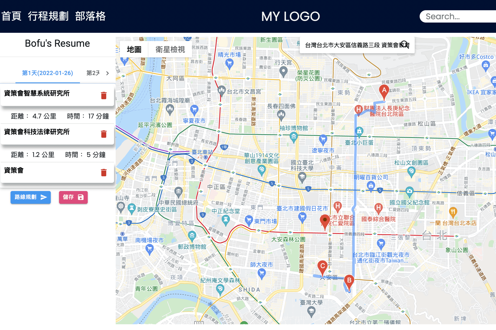

# 旅。行
> 採用前後端分離的模式，前端使用React框架，後端採用Java SpringBoot框架、OR-Mapping技術對應ＭySQL資料庫。網頁基本功能以Google Maps Api配合React框架特性實現旅遊中的行程規劃功能。會員功能採用Firebase第三方登入，並以RESTful API實現前後端資料交換後，提供部落格、行程分享以及後台系統等實作




## Installation
> 須與BackendAPI專案共同使用
 
### Travel Front-end Part
```
git clone https://github.com/Bofutw/Web_Demo.git

cd Web_Demo

npm install

npm start
```

### Travel Back-end Part
```
git clone https://github.com/Bofutw/BackendAPI.git

cd BackendAPI

npm install

npm start
```

## Contact

Bofu – [@CakeResume](https://www.cakeresume.com/bofuchen) – bofusoci@gmail.com


